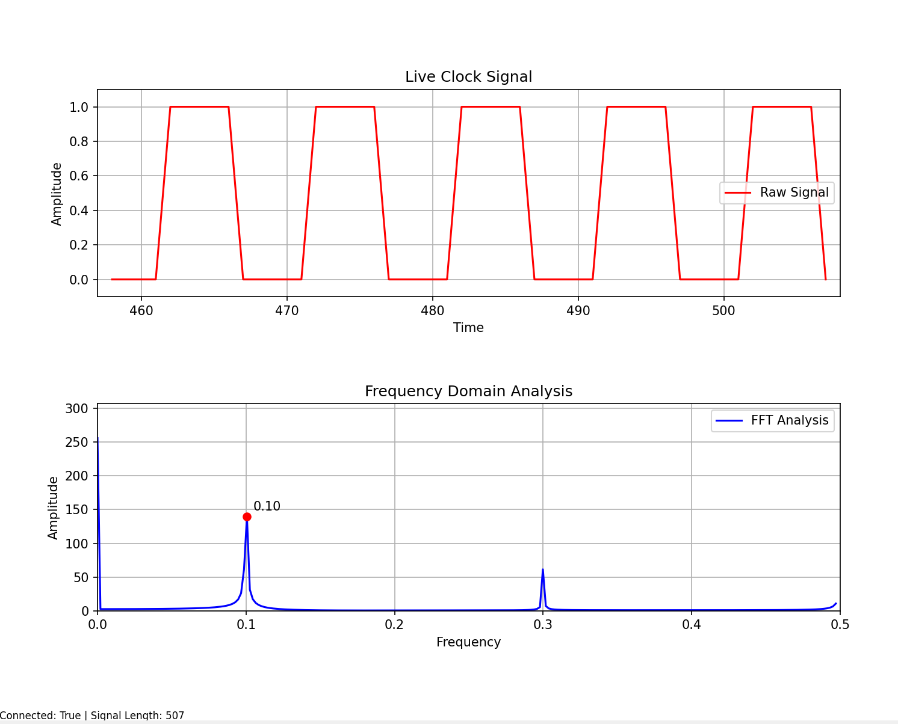
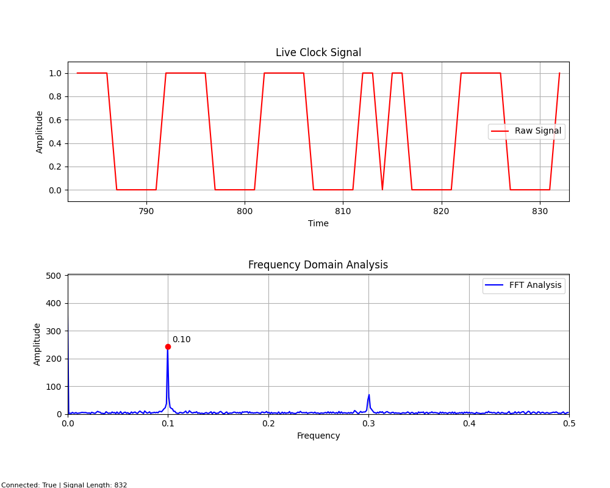

# Instructions
- Clone the repo or download the following files:
  - `clock_freq_server.py`
  - `clock_observer.py`
  - `FFTdata_observer.py` 
- Run the program with the following:
  - `python .\clock_freq_server.py`
    - include `-b True` for binary clock signal
    - include `-f True` for jittery floating point clock signal
    - include `-g True` to introduce a single clock glitch
    - include `-gf <frame>` to set which frame to glitch
    - include `-fft True` to automatically run the `FFTdata_observer.py` program
  - example: `python .\clock_freq_server.py -f True -g True -fft True -gf 3001`
- `FFTdata_observer.py` is run automatically when using the `-fft` flag set to `True`
- `clock_observer.py` is run automatically when the `-fft` flag in not set
- Sit back and enjoy
- Close the programs by closing the plot window

## FLAGS
```
"-b", "--binary", type=bool, default=False
"-f", "--float", type=bool, default=False
"-g", "--glitch", type=bool, default=False
"-gf", "--glitchframe", type=int, default=500
"-fft", "--fftanalysis", type=bool, default=False
```

## Output of `-h` help flag:
```
python .\clock_freq_server.py -h

Clock frequency server with glitching.

options:
  -h, --help            show this help message and exit
  -b, --binary BINARY   Clean binary clock signal.
  -f, --float FLOAT     Jittery floating point clock signal.
  -g, --glitch GLITCH   Introduce a clock glitch.
  -gf, --glitchframe GLITCHFRAME
                        Frame to introduce glitch.
  -fft, --fftanalysis FFTANALYSIS
                        Perform FFT analysis.
```


# Screenshots
Pure integer signal with FFT analysis - 507 samples


Pure integer glitched signal with FFT analysis - 832 samples


---