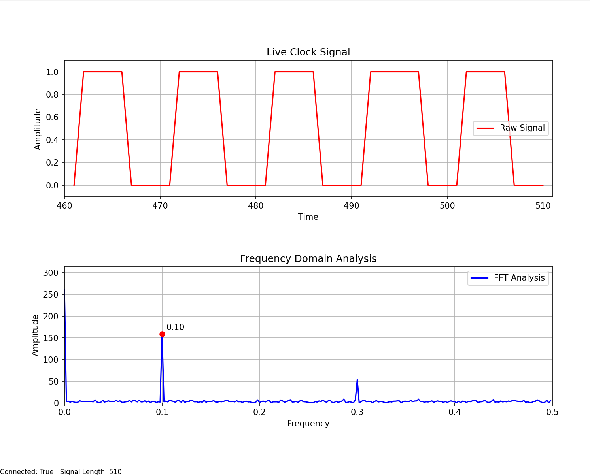
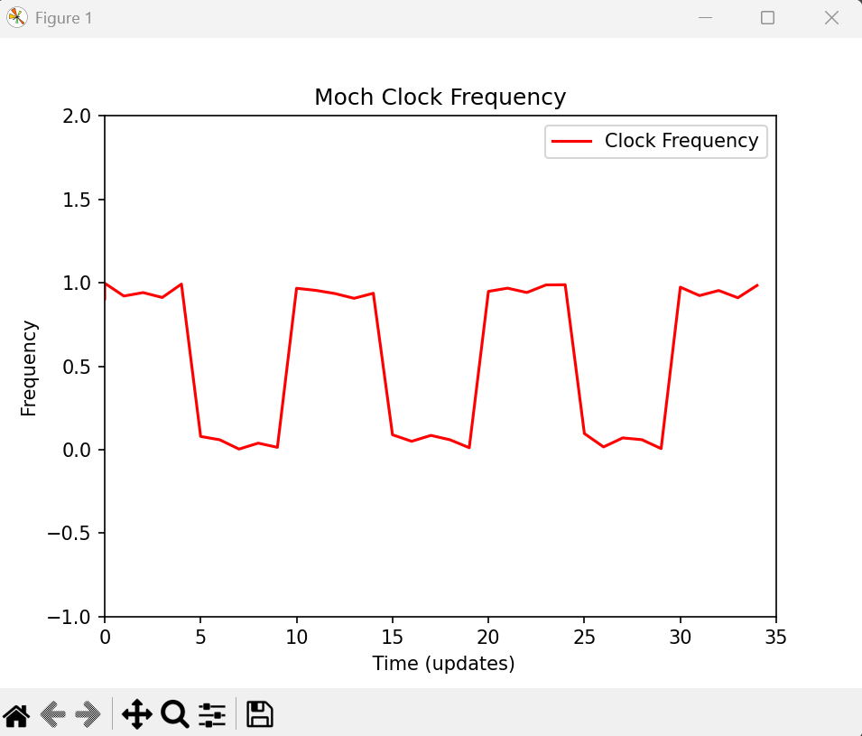
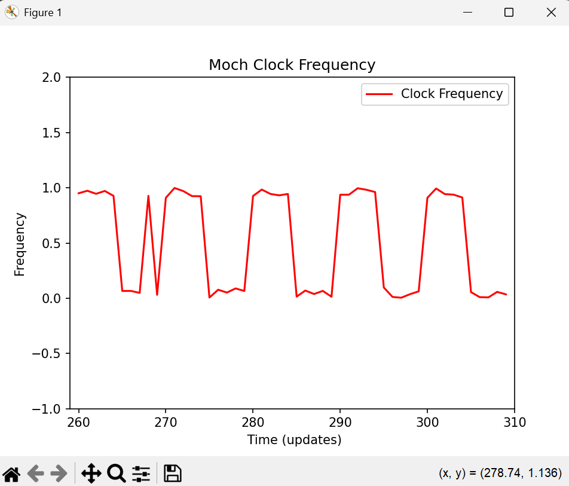
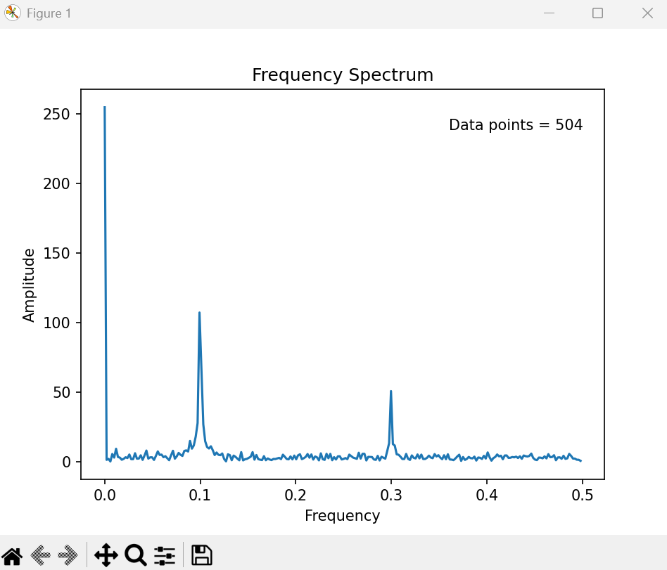

# New and improved instructions
- Run `clock_freq_server.py` (unglitched) or `clock_freq_glitches_server.py`
- Run `FFTdata_observer.py`
- Sit back and enjoy while I continue to work on floating point jittery signals

# Screenshots
Pure integer signal with FFT analysis - 507 samples

Pure integer glitched signal with FFT analysis - 510 samples

Pure integer glitched signal with FFT analysis - 832 samples

---

# Old Instructions

- Run `python ./clock_freq_floatstream_glitches_server.py` first
- Run `python ./ clock_observer_statistical_data_extractor.py` second
- Let run for a bit to collect data
- Close the window showing the servers output
- The observer will do its FFT analysis and create a plot

# Old Screenshots
Clock with jitter

Clock with jitter and glitch

Observer FFT analysis output plot
